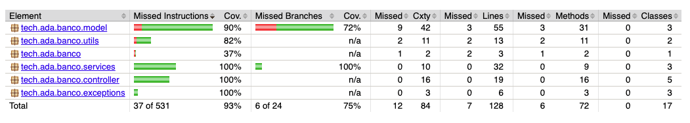
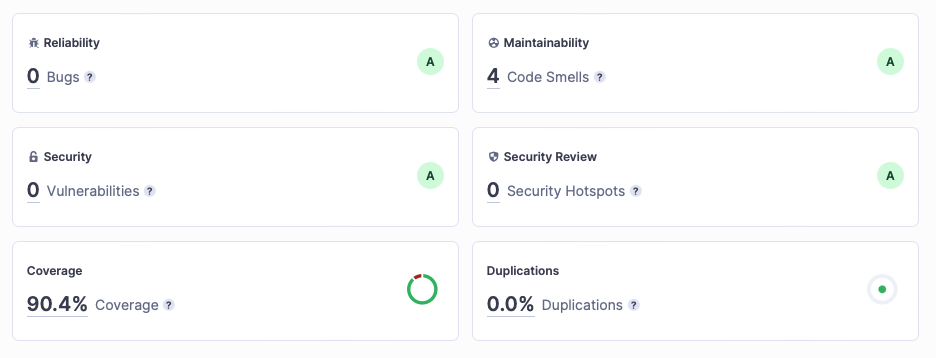

# Tests with Spring Boot JUnit 5 and Mockito

This project is a homework assignment for the course "Santander Coders" at the Ada. It is a simple example of how to test a Spring Boot application with JUnit 5 and Mockito.

## Jacoco test coverage report



## SonarCloud analysis



## How to run the tests

To run the tests, you need to have Java 17 installed on your machine. Then, you can run the following command:

```bash
mvn test
```

## How to generate the test coverage report

To generate the test coverage report, you need to have Java 17 and Maven installed on your machine. Then, you can run the following command:

```bash
mvn clean install
```

After that, you can find the report in the `target/site/jacoco/index.html` file.